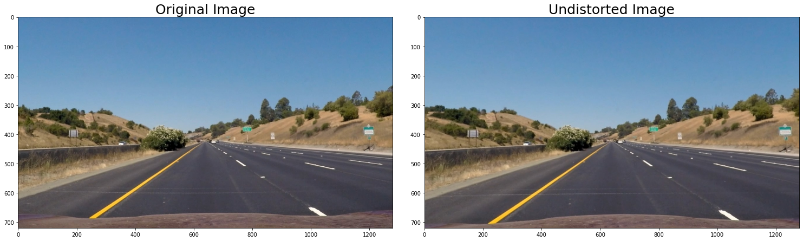

# Advanced Lane Finding Project

[](http://www.udacity.com/drive)

The goals / steps of this project are the following:

* Compute the camera calibration matrix and distortion coefficients given a set of chessboard images.
* Apply a distortion correction to raw images.
* Use color transforms, gradients, etc., to create a thresholded binary image.
* Apply a perspective transform to rectify binary image ("birds-eye view").
* Detect lane pixels and fit to find the lane boundary.
* Determine the curvature of the lane and vehicle position with respect to center.
* Warp the detected lane boundaries back onto the original image.
* Output visual display of the lane boundaries and numerical estimation of lane curvature and vehicle position.

---
## Camera Calibration
I used chessboard corners and cv2 functions to calibrate the camera. For each chessboard image, it has **object points** and **image points**. As I used the given dataset which are the pictures of same chessboard, object points will be same simple integer coordinate values for every picture. Meanwhile, image points are different by pictures, which is acquired by `cv2.findChessboardCorners()`

Camera matrix and distortion coefficients could easily be calculated using `cv2.calibrateCamera()` once **object points** and **image points** are prepared, then `cv2.undistort()` returns flattened image. I've defined `Calibrator` class that remembers the coefficients and wraps cv2 functions so that it can easily be accessed.


## Pipeline Description

### 1. Image Distortion Correction
First part of pipeline is a simple distortion correction. There are only slight changes, but it can be noticed at the boundary of image. This flattens the straight line.



### 2. Gradients Threshold & Color Transform
Second part of pipeline deals with colors.

I've applied the gradients threshold on the undistorted image. The hyperparameters are `sobel_kernel=15`, `mag_thresh=(50, 255)`, `dir_thresh=(0.7, 1.3)`. This is implemented in  `GradientThreshold` class.


Then, I tranformed color space to HLS and applyed thresholds. It is important that different thresholds are applied to detect white and yellow lane lines. This is implemented in  `ColorThreshold` class.

**White**
- Saturation (0, 255)
- Brightness (208, 255)

**Yellow**
- Saturation (100, 255)
- Brightness (130, 255)

For white lane, the saturation cannot be defined definitively. On the other hand, for yellow lane, the brightness is not as bright as white lane. I detected each line and combined it into single image.


### 3. Perspective Transform
I've set the source and destination coordinates as below. This is implemented in  `PerspectiveTransformer` class.

| Source        | Destination   |
|:-------------:|:-------------:|
| 575, 460      | 320, 0        |
| 705, 460      | 960, 0        |
| 1130, 720     | 960, 720      |
| 150, 720      | 320, 720      | 

When masked, it looks like this picture.


When transformed, the result is like below.


### 4. Lane Finding
I applied sliding window technique to identify the lane pixels then fitted 2nd order polymomial. The left lane looks great. However, the left line might look quite different from expectation. I'll discuss about this in the last part. This is implemented in  `LaneLineFinder` class.


### 5. Calculating Radius of Curvature and Vehicle Center

This is implemented as part of  `LaneLineFinder` class. The vehicle center is calculated by averaging x value of bottom end of two polynomials. I fitted the polynomial to the pixel x, y unit, then converted those coefficients to meters. Here's how I did.

```Python
left_fit_m = np.zeros_like(left_fit_pix)
left_fit_m[0] = left_fit_pix[0]*mx/(my**2)
left_fit_m[1] = left_fit_pix[1]*mx/my
left_fit_m[2] = left_fit_pix[2]*mx
right_fit_m = np.zeros_like(right_fit_pix)
right_fit_m[0] = right_fit_pix[0]*mx/(my**2)
right_fit_m[1] = right_fit_pix[1]*mx/my
right_fit_m[2] = right_fit_pix[2]*mx

y_eval = np.max(ploty_pix)*

left_curverad = ((1 + (2*left_fit_m[0]*y_eval + left_fit_m[1])**2)**1.5) / np.absolute(2*left_fit_m[0])
right_curverad = ((1 + (2*right_fit_m[0]*y_eval + right_fit_m[1])**2)**1.5) / np.absolute(2*right_fit_m[0])
```


### 6. Plotting Lane Line on Image / Inverse Transform

This is implemented in the **part 4-2** in `code/pipeline.ipynb`. It draws green polygon along left and right lanes in the birdeye view. Then, it is warped back and added on original image.


---

## Pipeline (video)

<video height="150" controls>
    <source src="./media/output_video/project_video.mp4" type="video/mp4">
    Failed to load html video.
</video>

If video is not visible, watch it [here](./media/output_video/project_video.mp4).

---

## Discussion
### 1. Weak Robustness
The lane lines are isolated from the image by thresholding brightness and saturation in this project. However, the definitive threshold is not appropriate as road conditions and brightness continuously changes. It may require an adaptive approach like *relative* brightness compared to the other part of the image.

### 2. Wobbling Fitting Lines
My pipeline wobbles when it fits polynomials to the dotted lane while continuous line is fairly stable. The line sometime doesn't fit as what I expected. The right lane is supposed to be head left but it actualy isn't.

The far part of lines are exaggrated by warping. The boundary of each dotted lane ends are supposed to be horizontal. However it looks quite tilted, resulting distorted pixel distribution.

I guess this can be fix by more precise warping and by fixing bottom end of polynomial to the starting point of lane where **we already know**.


