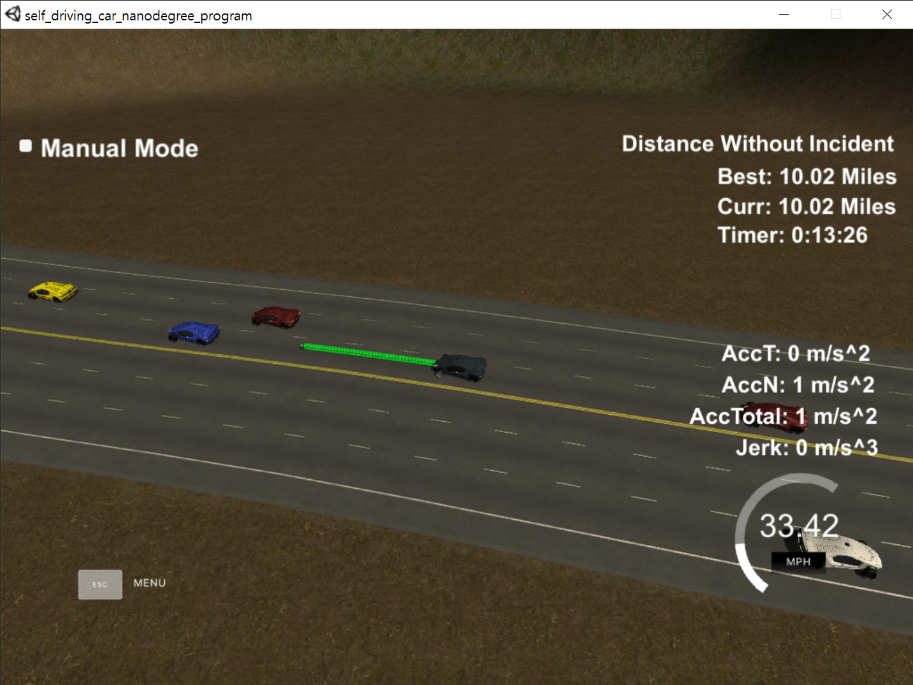

# CarND-Path-Planning-Project
Self-Driving Car Engineer Nanodegree Program
   
### Simulator.
You can download the Term3 Simulator which contains the Path Planning Project from the [releases tab (https://github.com/udacity/self-driving-car-sim/releases/tag/T3_v1.2).  

## Project Explanation

This project is the 7th project of Udacity Self-Driving Car Nanodegree program. The goal of this project is to make **behavior/path planner** that can drive the car in highway situation safely and efficiently.

### Basic Build Instructions

1. Clone this repo.
2. Make a build directory: `mkdir build && cd build`
3. Compile: `cmake .. && make`
4. Run it: `./path_planning`.

### Dependencies

* cmake >= 3.5
* make >= 4.1
* gcc/g++ >= 5.4
* [uWebSockets](https://github.com/uWebSockets/uWebSockets)
  * Run either `install-mac.sh` or `install-ubuntu.sh`.
  * If you install from source, checkout to commit `e94b6e1`, i.e.
    ```
    git clone https://github.com/uWebSockets/uWebSockets 
    cd uWebSockets
    git checkout e94b6e1
    ```
## Pipeline Description
My pipeline consists of 3 processes. Prediction, behavior planning and path planning. These are implemented in two classes. `Predictor` and `BehaviorPlanner`. In main.cpp, these lines execute the whole process.
```C++
// prediction part
Predictor predictor(car_s, car_d, car_speed);
predictor.predict(sensor_fusion, previous_path_x.size());

// behavior & path planning part
BehaviorPlanner planner(car_x, car_y, car_yaw, car_s, car_d, car_speed);
planner.setDestination(end_path_s, end_path_d, predictor.getAvailableSpeed(), 
                       predictor.getClosestCarS(), predictor.getAvailableLanes());
planner.setPath(next_x_vals, next_y_vals, previous_path_x, previous_path_y,
                end_path_s, getXYcallback, getFrenetcallback);
```

### Prediction
In prediction step, we first convert the frenet d-value to lane line. It can be value of 0, 1 and 2. Next, the predictor determines the available lanes by comparing the frenet s-value of my car and that of traffic while executing current path. If the traffic is 20 meters ahead or 10 meters behind of path at that time step, it may cause collision so predictor mark that lane as not available.

The predictor returns available lanes, frenet position and speed of traffics ahead of my car.

```C++
// determine availability by prediction position
if (car_lane == opponents_lane[i]) {                                            
    if (distance_predict <= DISTANCE_FRONT_GAP && distance_predict >= 0) {
        available_lanes[opponents_lane[i] = false;                            
    }
} else {                                           
    if (distance_predict <= DISTANCE_FRONT_GAP && 
        distance_predict >= -DISTANCE_BEHIND_GAP) {    
        available_lanes[opponents_lane[i]] = false;                                     
    }
}
```
You may see `predictor.h` and `predictor.cpp` for further detail.

### Behavior Planning
Behavior planner receives required information from predictor. In behavior planning step, we first identify left or right lanes to change. If car is not blocked by traffic, it will maintain its current lane. Otherwise, it will move to left or right lane.

The car will recover to the center lane whenever it is available.

```C++
    // find left or right lane to change.
    for (int i=0; i<=1; i++) {
        int left_lane = start_lane-i;
        int right_lane = start_lane+i;
        // priority on left lane for overtaking
        if(left_lane>=0 && left_lane<=2) {
            if(available_lanes[left_lane]) {
                final_lane = left_lane;
                break;
            }
        }
        if(right_lane>=0 && right_lane<=2) {
            if(available_lanes[right_lane]) {
                final_lane = right_lane;
                break;
            }
        }
    }
```
However, there always would be the case my car is blocked by the traffic ahead, while another car is blocking sideways. An accident may happen if my car changes the lane or does not slow down.

The behavior planning step returns final lanes to move and final velocity to accelerate.

```C++
// if car in front is too close
double front_distance = closest_car_s[start_lane] - end_path_s;
if (front_distance < SAFETY_GAP ) {
    printf("slow down!\n");
    final_speed = available_speed[start_lane];
} else {
    // if ego car is slower than setting speed
    final_speed = MAX_SPEED;
}
```

### Path Planning
Now, we're in the possibly hardest part of this project. In path planning, there are two cases. These are mathematically identical, but information for path generating is derived different way.
1. If previous path does not exist(fresh start), whole path will be generated based on current car position and prediction.
2. Or if previous path exist, the previous path will be reused and new path will be generated/concatenated based on the *state at the last point* of previous path. 

There are 3 coordinate system used in path planning. **Frenet coordinate** is the one we learned in the lesson. **Global(map) cartesian coordinate** has it's origin at starting point. The path that we pass to simulater must be written in global cartesian. Lastly, we use **local cartesian coordinate**. This may easily be confused with frenet coordinate. In local cartesian, positive x-direction is straight ahead of car, whereas positive s-direction is along the curve of road. Local cartesian and global cartesian are linearly transformable to each other. Local cartesian will be used to fit the spline. 

    
First, we define the inital position of new path. If previous path does not exists, it will be car's position. Else, we use the last point of previous path because we're going to concatenate new path to previous one.

```C++
double prev_path_size = previous_path_x.size();
double new_path_start_s;
if (prev_path_size == 0) {  
    new_path_start_s = car_s;
} else {                    
    new_path_start_s = end_path_s;
}
```

Second, derive the boundary condition for spline from previous path end in **global(map) cartesian coordinate**. The boundary conditions are initial position and slope. We'll use two points instead of slope for boundary condition to fit spline. Still, it is important to know the slope(yaw).
```C++
if (prev_path_size < 2) {
    double prev_global_x = car_x-cos(car_yaw);
    double prev_global_y = car_y-sin(car_yaw);

    // This will be the boundary condition for spline
    global_waypoints_x.push_back(prev_global_x);
    global_waypoints_y.push_back(prev_global_y);
    global_waypoints_x.push_back(car_x);
    global_waypoints_y.push_back(car_y);

    // state at path end
    global_path_end_x = car_x;
    global_path_end_y = car_y;
    global_path_end_yaw = car_yaw;
} else {
// use path_end_yaw for boundary condition
    double prev_global_x = previous_path_x[prev_path_size-2];
    double prev_global_y = previous_path_y[prev_path_size-2];
    double global_x = previous_path_x[prev_path_size-1];
    double global_y = previous_path_y[prev_path_size-1];

    // This will be the boundary condition for spline
    global_waypoints_x.push_back(prev_global_x);
    global_waypoints_y.push_back(prev_global_y);
    global_waypoints_x.push_back(global_x);
    global_waypoints_y.push_back(global_y);

    // states at path end
    global_path_end_x = global_x;
    global_path_end_y = global_y;
    global_path_end_yaw = atan2(global_y-prev_global_y, global_x-prev_global_x);
}
```

Third, we design the frenet waypoints to visit. The car will visit 30, 60, 90 meters ahead point of final lane, starting from the *previous path end.* Then, we keep it in global cartesian value.
```C++
vector<double> waypoints_s;
vector<double> waypoints_d;
waypoints_s.push_back(new_path_start_s+30); // destination
waypoints_d.push_back(2+final_lane*4);
waypoints_s.push_back(new_path_start_s+60); // for smoothing
waypoints_d.push_back(2+final_lane*4);
waypoints_s.push_back(new_path_start_s+90); // for smoothing
waypoints_d.push_back(2+final_lane*4);
// Complete frenet waypoints and convert to global cartesian.
for(int i=0; i<waypoints_s.size(); i++) {
    auto waypoint_xy = getXYfromMap(waypoints_s[i], waypoints_d[i]);
    double waypoint_x = waypoint_xy[0];
    double waypoint_y = waypoint_xy[1];

    global_waypoints_x.push_back(waypoint_x);
    global_waypoints_y.push_back(waypoint_y);
}
```

Fourth, convert global cartesian to local cartesian waypoints at *path end*. The spline will be fitted to these converted local cartesian points.
```C++
vector<double> local_waypoints_x;
vector<double> local_waypoints_y;

for(int i=0; i<global_waypoints_x.size(); i++) {
    double waypoint_x = global_waypoints_x[i];
    double waypoint_y = global_waypoints_y[i];

    //linear transformation to local cartesian.
    double local_x = (waypoint_x-global_path_end_x)*cos(0-global_path_end_yaw)-(waypoint_y-global_path_end_y)*sin(0-global_path_end_yaw); 
    double local_y = (waypoint_x-global_path_end_x)*sin(0-global_path_end_yaw)+(waypoint_y-global_path_end_y)*cos(0-global_path_end_yaw);

    local_waypoints_x.push_back(local_x);
    local_waypoints_y.push_back(local_y);
}
```

Finally, generating path! We'll fit the spline and concatenate to the previous path. Be aware that we need to convert to the global cartesian before passing it to the simulator. The x-delta is 0.02sec * 21m/s. The speed will be decelerated if behavior planner slowed the final speed.

```C++
double local_x = 0; 
// generating and concatenating on previous path.
for(int i=prev_path_size; i<50; i++) {
    if (current_speed > final_speed) {     // when deceleration is required
        current_speed -= MAX_ACC;
    } else {                            // when acceleration is required
        current_speed += MAX_ACC;          // speed up
        if(current_speed > MAX_SPEED) {    // within limit
            current_speed = MAX_SPEED;
        }
    }
    // move the car in local cartesian, then convert to global cartesian.
    double next_local_x = local_x + TIME_STEP*current_speed;
    double next_local_y = s(next_local_x);
    double next_global_x = global_path_end_x + next_local_x*cos(global_path_end_yaw) - next_local_y*sin(global_path_end_yaw);
    double next_global_y = global_path_end_y + next_local_x*sin(global_path_end_yaw) + next_local_y*cos(global_path_end_yaw);

    next_x_vals.push_back(next_global_x);
    next_y_vals.push_back(next_global_y);

    local_x = next_local_x;
}

```
That's it! Let's see how it works.

## Result
This model was able to drive more than 10 miles without any incident!


- Overtaking
- Acceleration
- Deceleration when stuck

  


