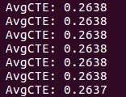
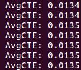

# CarND-Controls-PID
Self-Driving Car Engineer Nanodegree Program

---

## Dependencies

* cmake >= 3.5
* make >= 4.1(mac, linux), 3.81(Windows)
* gcc/g++ >= 5.4
* [uWebSockets](https://github.com/uWebSockets/uWebSockets)
  * Run either `./install-mac.sh` or `./install-ubuntu.sh`.
  * If you install from source, checkout to commit `e94b6e1`, i.e.
    ```
    git clone https://github.com/uWebSockets/uWebSockets 
    cd uWebSockets
    git checkout e94b6e1
    ```
* Simulator. You can download these from the [project intro page](https://github.com/udacity/self-driving-car-sim/releases) in the classroom.

## Basic Build Instructions

1. Clone this repo.
2. Make a build directory: `mkdir build && cd build`
3. Compile: `cmake .. && make`
4. Run it: `./pid`. 

---

## Parameter Tuning
This is very simple PID controller implementation project. Here's how I tuned my controller. These 5 lines explain all the details.
```C++
//pid.Init(0.05, 0, 0); // not providing enough steering for sharp corner
//pid.Init(0.2, 0, 0); // able to handle sharp turn but oscilliation diverges
//pid.Init(0.2, 0, 1); // not enough D damping.
//pid.Init(0.2, 0, 4); // average cte > 0.25 (biased)
pid.Init(0.2, 0.001, 4); // final parameters, average cte < 0.001 after one lap.

```
### Tuning P-Coefficient
Let's begin with P-control. The lake race track has some tight corners. The controller must be responsive enough to make sharp turns. Here's my first attempt with `Kp = 0.05`.


Oops, the car almost dived into the lake. The controller needs to be more sensitive. Let's increase it to `Kp = 0.2`.

 

Now, it's able to make such turn. However, the oscilliation will diverges out of lane. We need to introduce PD-controller to damp this oscillication.


### Tuning D-coefficient
Here's my trial with `Kd = 1`. It seems a bit better than before, but still wobbles. We need more damping effect. If passengers are riding this car, they will definitely suffer from terrible car sickness. 


Increased the value to `Kd = 4`. Now, it is driving along the track smoothly and nicely. Still, there's a parameter to improve. The average CTE along the track is observed as around `0.25` which means the car is slightly bias towards right.

 

### Tuning I-coefficient
Finally, I introduced PID controller with `Ki = 0.001`. This small number was able to suppress this bias effectively under `0.02`!

*Click the image to watch the full video.*

<a href="https://www.youtube.com/watch?v=Pdxvy8JCFQo"></a> 

Thus, the final parameters chosen are `Kp=0.2, Ki=0.001, Kd=4`.
