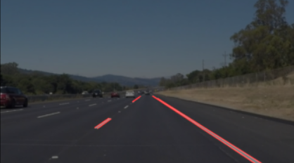
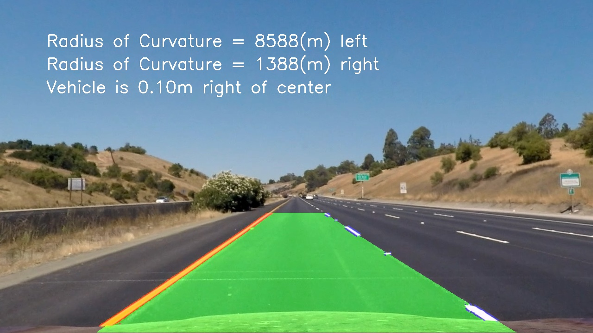
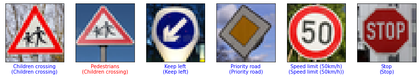
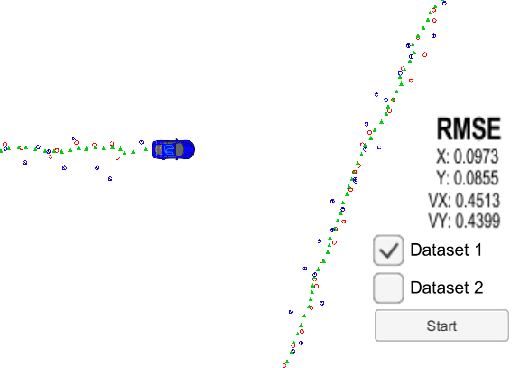
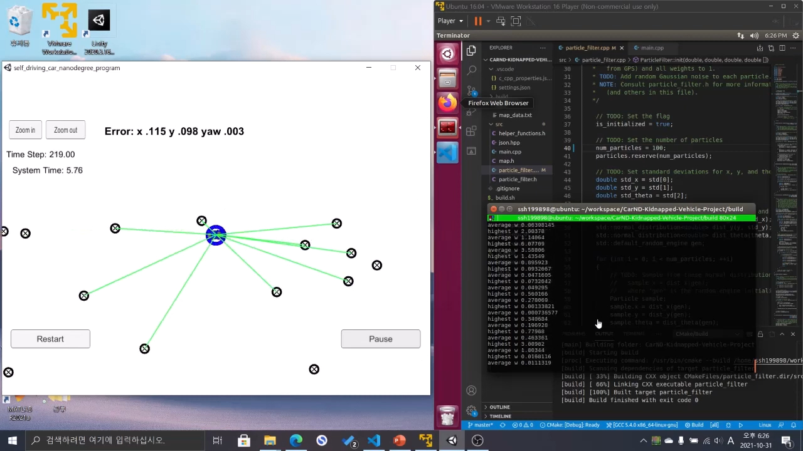
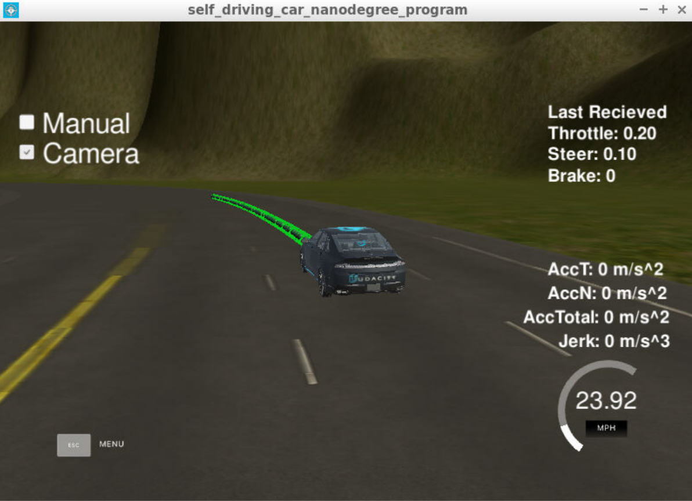

# Udacity Self-Driving Car Nanodgree Projects Collection

This is my portfolio of projects that I've done in Udacity's Self-Driving Car Nanodegree. It consists of 9 projects.

### 1. Lane Line Finding

A simple computer vision project on detecting lane line in highway.

### 2. Advanced Lane Line Finding

A more advanced lane line detection algorithm with simple computational geometry.

### 3. Traffic Sign Classifier

A project on traffic sign classifier for [German Traffic Sign Dataset](https://benchmark.ini.rub.de/?section=gtsrb&subsection=dataset) implemented with TensorFlow 1!

### 4. Behavioral Cloning

The goal of this project is to apply deep learning principle to behavioral cloning of self-driving car. The convolutional neural network predicts the steering angle from the road image taken from the camera attached to the car.

 

### 5. Extended Kalman Filters

In this project, I utilize a kalman filter to estimate the state of a moving object of interest with noisy lidar and radar measurements.

  

### 6. Kidnapped Vehicle

An implementation of a particle filter for the localization of kiddnapped vehicle!

 

### 7. Path Planning in Highway

This is a very serious project on implementing the path planner. The goal of this project is to make **behavior/path planner** that can drive the car in highway situation safely and efficiently.

 
 

### 8. PID Control

A simple PID Controller that drives the car around the lake view track!

### 9. System Integration in ROS

The capstone project of Self-Driving Car Nanodgree. In this project, I integrate all the modules that I've developed earlier and run the car in the simulator!

